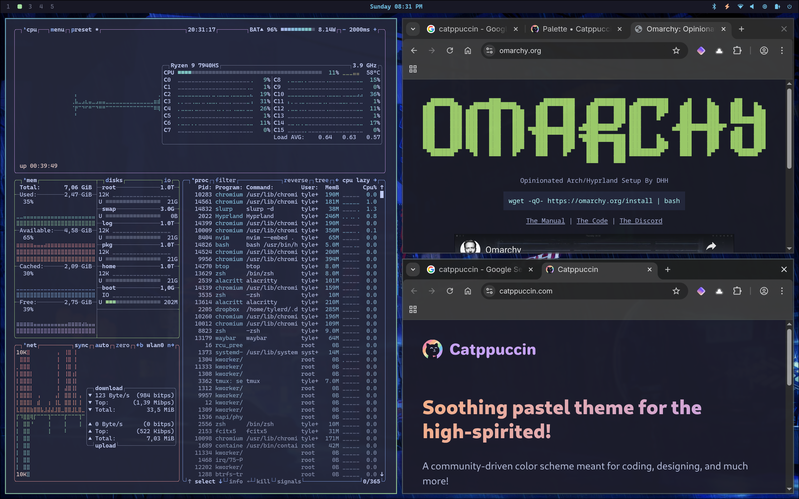

# DOTFILES

pre release - use with caution

I use [stow] (on a desktop/laptop) to manage my dotfiles. 

## Install

After cloning, run:

``` sh 
./install.sh
```

or 

``` sh 
stow @core -t ~/
stow @linux -t ~/
stow @macos -t ~/
```

# Themes

## [Catppuccin]




- [Catppuccin Wallpapers]

[stow]:https://www.gnu.org/software/stow/
[Catppuccin]:https://catppuccin.com/
[Catppuccin Wallpapers]:https://github.com/zhichaoh/catppuccin-wallpapers
